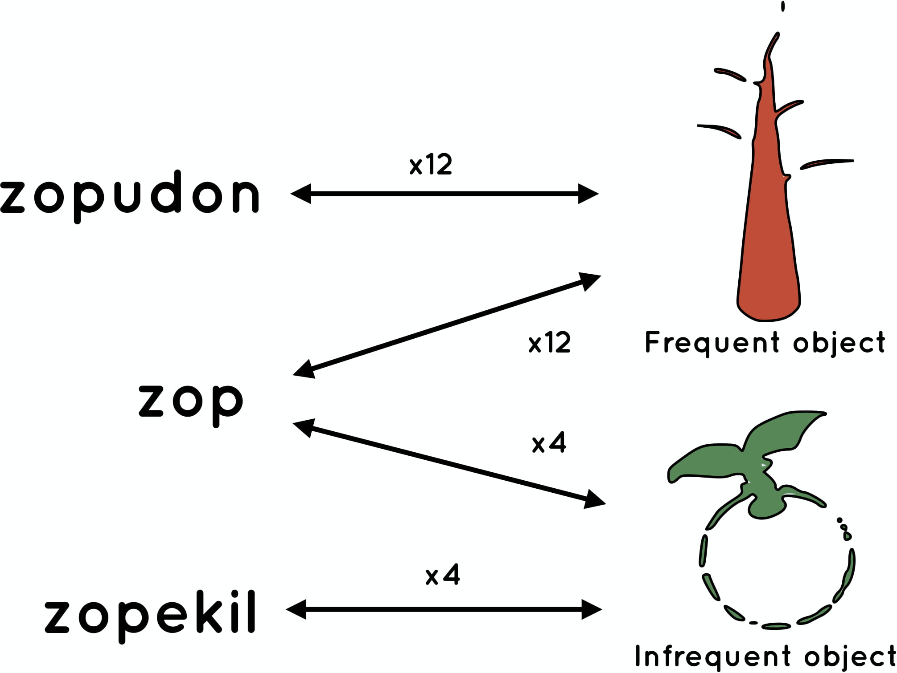
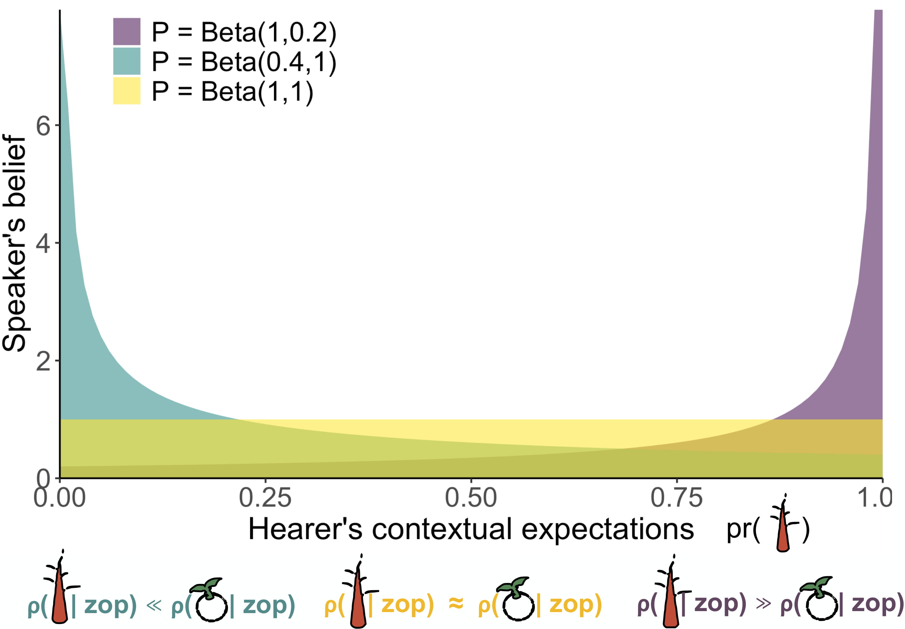
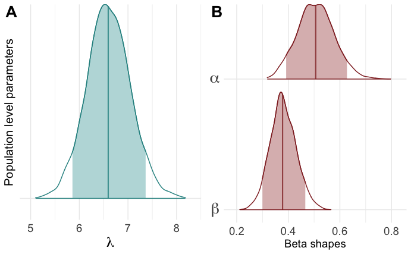
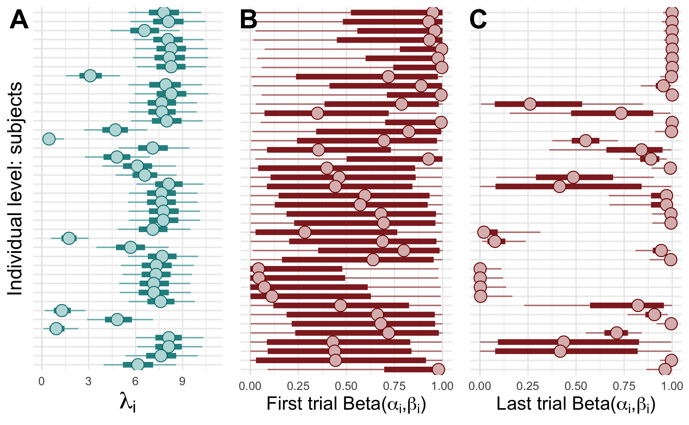

```{r preamble, echo=FALSE, message=FALSE, warning=FALSE}
library(dplyr)
library(ggplot2)
library(readr)

```


# Background

.large[
* Zipf's Law of Abbreviation: frequent forms are shorter

* Inverse relationship between *use* and *linguistic reduction*

* Kanwal et al. (2017): study what drives this relationship <br>by controlling for communicative pressures
]
---

# Background 

.large[
* Zipf's Law of Abbreviation: frequent forms are shorter <br>**at the level of languages**

* Inverse relationship between *use* and *linguistic reduction*
<br> **across different strata**

* Kanwal et al. (2017): study what drives this relationship by <br>controlling for communicative pressures **at the level of dyads**
]

---
# This work
Re-analysis of Kanwal et al. (2017) to
  * be explicit about speakers' choice functions
  
  * analyse how population-level, dyadic-level and individual-level relate to each other
<br><br>
<br><br>
<br><br><br><br>


.footnote[
***
[Brief at the risk of being misunderstood: Consolidating population- and individual-level tendencies](http://brochhagen.github.io/brochhagen.github.io/content/ms/accepted-manuscript-cobb.pdf). Forthcoming. *Computational Brain & Behavior*.
]

---
# Today's talk
Re-analysis of Kanwal et al. (2017) to
  * ~~be explicit about speakers' choice functions~~
  
  * analyse how population-level, dyadic-level and individual-level relate to each other
<br><br>
<br><br>
<br><br><br><br>


.footnote[
***
[Brief at the risk of being misunderstood: Consolidating population- and individual-level tendencies](http://brochhagen.github.io/brochhagen.github.io/content/ms/accepted-manuscript-cobb.pdf). Forthcoming. *Computational Brain & Behavior*.
]


---

class: inverse, center

# Experimental setup
Kanwal et al. (2017) condition 4

---

## Training
```{r, out.width="80%", fig.align="center", echo=FALSE, }

```


---
# Testing

* Pair subjects and let them play for 62 trials<br>32 sender trials, 32 receiver trials (alternating)

* Same object frequencies as in training

* Message transmission time is proportional to message length<br> $\rightarrow$ Sending ambiguous *zop* takes $\frac{3}{7}$ of the time of alternatives 

* "The fastest & most accurate pairs win a prize"<br> $\rightarrow$ Pressure to use short form if you believe your interlocutor will get it

---

# Kanwal et al's analysis

* Logistic regression with short name as binary response

* Object frequency, trial number, and their interaction as fixed effects

* By-participant intercepts and slopes as random effects for object frequency and trial number

$\rightarrow$ Positive interaction between trial number and the short name for the frequent object
---

class: inverse, center

# Model

---
## Model intuitions

* RSA-style choice functions
<br><br>"If I believe you expect one object over the other (by a large enough margin) I will use the ambiguous form to convey that object. Otherwise, I'll play it safe."<br><br>


* Agents update beliefs over time, based on success/failure using an ambiguous form<br><br>"You interpreted my use of an ambiguous form in a certain way before, thus, I believe you expected this object (and therefore I will be more likely to signal this object with this expression later)"

---
## Relevant parameters to estimate from the data

.left-column[
<br>
$\lambda$

$pr \sim P$ 
]

.right-column[
usual soft-maximization parameter $\lambda \geq 0$

not-so-usual non-common prior
]

---

## Latent beliefs over expectations

```{r, out.width="100%", fig.align="center", echo=FALSE, }

```

---

class: inverse, center

# Results

---

## >> Fastforward

* ... fits to models of varying complexity 
* ... diagnostics
* ... PSIS-LOO cross validation
* ... model comparisons
* ... alternative data splits
<br><br><br>

**Best model**: multi-level model with a population-level estimate for both $\lambda$ and $P$ (as a Beta distribution with two population-level shape parameters)

---

## Population-level estimates

```{r, out.width="110%", fig.align="center", echo=FALSE, }

```

---
## Individual-level estimates

```{r, out.width="110%", fig.align="center", echo=FALSE, }

```

---

class: inverse, center

# Take-aways


---

1. Where possible and called for
  * model variation at multiple levels
  
  * make relationship between levels explicit 

2. Population-level trends can often hide individual-level variation, but the former ultimately draw from the latter.

--

3. Many individual-level patterns go against theoretical predictions (Zipf's Law of Abbreviation, Horn's division of pragmatic labor, Parikh's disambiguation model, ...). The reasons for this are manifold.

--

4. How dyadic-conventions find their way into the population is still a major and fascinating open question

--

5. Whether the association of the ambiguous form with the (in)frequent meaning is semantic or pragmatic in nature is (less fascinating?) open question

---

class: inverse, center


# Questions, comments, complaints?

