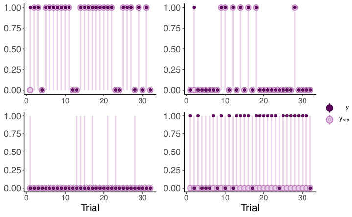

```{r preamble, echo=FALSE, message=FALSE, warning=FALSE}
library(dplyr)
library(ggplot2)
library(readr)

```


# Background

.large[
* Zipf's Law of Abbreviation: frequent forms are shorter

* Inverse relationship between *use* and *linguistic reduction*

* Kanwal et al. (2017): study what drives this relationship <br>by controlling for communicative pressures
]
---

# Background 

.large[
Zipf's Law of Abbreviation: frequent forms are shorter <br>**at the level of languages**
]

.footnote[
***
Zipf (1935): [The Psycho-Biology of Language]()<br><br>
Sigurd et al. (2004): [Word length, sentence length and frequency – Zipf revisited]()<br><br>
Piantadosi et al. (2011): [Word lengths are optimized for efficient communication]()<br><br>
Ferrer-i-Cancho et al. (2013): [Compression as a Universal Principle of Animal Behavior]()<br><br>
...
]


---

# Background 

.large[
Inverse relationship between *use* and *linguistic reduction*
<br> **across strata**
]

.footnote[
***
Clark & Wilkes-Gibbs (1986): [Referring as a collaborative process]()<br><br>
Kim et al. (2011): [Phonetic convergence in spontaneous conversations as a function of interlocutor language distance]()<br><br>
Pickering & Ferreira (2008):  [Structural priming:  A critical review]()<br><br>
Hawkins et al (2017): [Convention-formation in iterated reference games]()<br><br>
...
]

---

# Background 

.large[
Kanwal et al. (2017) study what drives the relationship between<br> frequency and form by controlling for communicative pressures<br> **at the level of dyads**
]

.footnote[
***
Kanwal et al. (2017): [Zipf’s Law of Abbreviation and the Principle of Least Effort: Language users optimise a miniature lexicon for efficient communication](). *Cognition*
]

---

# The study I'll build on today 
Modest re-analysis of Kanwal et al. (2017) to
  * explicitly model subjects' behavior
  
  * gain insight into how population-level, dyadic-level and individual-level relate to each other; and how to possibly begin to link them
<br><br>
<br><br>
<br><br><br><br>


.footnote[
***
Brochhagen (2021): [Brief at the risk of being misunderstood: Consolidating population- and individual-level tendencies](http://brochhagen.github.io/brochhagen.github.io/content/ms/accepted-manuscript-cobb.pdf). *Computational Brain & Behavior*
]

---

class: inverse, center

# Experimental setup
Kanwal et al. (2017) condition 4

---

## Training (miniature lexicon acquisition)
```{r, out.width="80%", fig.align="center", echo=FALSE, }
knitr::include_graphics('./artificial-language-cropped.jpg')
```


---
# Testing (condition 4) 

* Pair subjects and let them interact for 62 trials<br><br>32 sender trials, 32 receiver trials (alternating)<br><br>

* Same object frequencies as in training<br><br>

* Message transmission time is proportional to message length<br> $\rightarrow$ Sending ambiguous *zop* takes $\frac{3}{7}$ of the time of alternatives <br><br>

* The fastest & most accurate pairs win a prize<br> $\rightarrow$ Pressure to use short form if you believe your interlocutor will get it

---

# Kanwal et al's analysis

* Logistic regression with short name as binary response<br><br>

* Object frequency (frequent/infrequent), trial number, and their interaction as fixed effects<br><br>

* By-participant intercepts and slopes as random effects for object frequency and trial number<br><br><br><br>

**Finding:** Positive effect of trial number on short form use only for frequent object<br><br>

---

# Some open questions

1. How did individual speakers behave?<br><br>
  * Change over time
  * On what strategies did they converge<br><br>
2. How did their behavior compare to that of their partners?<br><br>
3. How do population-level predictions compare to (1) and (2)?<br><br>
4. How can we relate trends from individuals and dyads to a community of speakers?

---

# Some model desiderata

* Accommodate for multiple association patterns (cf. Parikh 2000)

* Accommodate for signaling behavior that can change as a function of interlocutor's behavior

.footnote[
***
Parikh (2000): [Communication, Meaning, and Interpretation]()<br><br>
Brochhagen (2017): [ Signalling under Uncertainty: Interpretative Alignment without a Common Prior ]()<br><br>
Hawkins et al (2017): [Convention-formation in iterated reference games]()


]

---

class: inverse, center

# Speaker model

.footnote[
***
We return to model identifiability between Brochhagen (2017) and Hawkins et al. (2017) at the end

]


---
## Intuitions

* RSA-style choice functions (*soft-max*; *Luce's rule*; *rationality parameter*)
<br><br>"If I believe you expect one object over the other (by a large enough margin) I will use the ambiguous but preferred form to convey that object. Otherwise, I'll play it safe."<br><br>

--

* Players can change beliefs over time, based on past success/failure using an ambiguous form<br><br>"You interpreted my use of an ambiguous form in a certain way before. Consequently, I believe you expected this object (and therefore I will be more likely to signal this object with this expression later)"

---
## Parameters to estimate from the data

.left-column[
<br>
$\lambda$
<br><br><br><br>
$pr \sim P$<br><br>
$P= \text{Beta}(\alpha,\beta)$
]

.right-column[
usual soft-maximization parameter, $\lambda \geq 0$
<br><br><br><br><br>
less usual beliefs over (non-common) prior
]


---


## Latent beliefs over expectations

```{r, out.width="100%", fig.align="center", echo=FALSE, }
knitr::include_graphics('./uncertainty-sketch-cropped.jpg')
```


---

## The full speaker model
<br><br>
\begin{align}
\rho(r \mid m;pr) &\propto L(r,m) \; pr(r),\\
\sigma(m \mid r;P) &\propto \text{exp}(\lambda((\int P(\theta)\rho(r \mid m; \theta)d\theta)-c(m))) 
\end{align}
<br>

--

and
\begin{align}
P_{t+1}(pr \mid w(r);m) \propto (\sum_{r' \in w(r)}\rho(r' \mid m;pr)P_t(pr)),
\end{align}
with $w(r) = \{r\}$ if the interaction was successful and $R \setminus \{r\}$ otherwise.


---


## Parameters to estimate from the data

.left-column[
<br>
$\lambda$
<br><br><br><br>
$P= \text{Beta}(\alpha,\beta)$
]

.right-column[
soft-maximization parameter, $\lambda \geq 0$
<br><br><br><br>
beliefs over (non-common) prior
]

---

class: inverse, center

# Models

---

```{r table2, echo=FALSE, message=FALSE, warnings=FALSE, results='asis'}
tabl <- "  # Overview
| Model        | Population parameters          | Individual parameters  |
|---------------|:-------------:|:------:|
| NoPool      | -- | $\\lambda_i, \\alpha_i, \\beta_i$ |
| FullPool $\\lambda,\\alpha, \\beta$      | $\\alpha,\\lambda, \\beta$ |   -- |
| FullPool $\\lambda$ | $\\lambda$      |  $\\alpha_i, \\beta_i$ |
| HM $\\lambda$      | $\\mu_\\lambda$ | $\\lambda_i \\sim N(\\mu_\\lambda,2)$ <br> $\\alpha_i, \\beta_i$ |
| HM $\\lambda, \\alpha, \\beta$      | $\\mu_\\lambda, \\mu_\\alpha, \\mu_\\beta$ | $\\lambda_i \\sim N(\\mu_\\lambda,2),$ <br> $\\alpha_i \\sim N(\\mu_\\alpha,2)$ <br> $\\beta_i \\sim N(\\mu_\\beta,2)$ |


"
cat(tabl) # output the table in a format good for HTML/PDF/docx conversion
```

---

class: inverse, center

# Results


.footnote[
***
All models were diagnosed to rule out pathologies, and cross-validated.
]

---


```{r table3, echo=FALSE, message=FALSE, warnings=FALSE, results='asis'}
tabl <- "  ## Model comparison (full dataset)
|         | ELPD diff (SE)          | ELPD (SE)  |  
|---------------|:-------------:|:------:|
| HM $\\lambda, \\alpha, \\beta$      |  0.00 (0.00) | -471.63 (18.74) |  
| HM $\\lambda$      |  -38.16 (5.74) | -509.79 (18.24) | 
| FullPool $\\lambda,\\alpha, \\beta$      |  -148.24 (12.17) | -619.88 (22.23) | 
| FullPool $\\lambda$ |  -154.21 (11.61) | -625.84 (21.24) | 
| NoPool      | -201.02 (34.55) | -672.65 (51.02) | 

"
cat(tabl) # output the table in a format good for HTML/PDF/docx conversion
```

<br><br>

**Finding** The best model, $HM_{\lambda,\alpha,\beta}$, is ranked first, also across other data subsets and when splitting dyads up

---

## Population-level estimates

```{r, out.width="110%", fig.align="center", echo=FALSE, }
knitr::include_graphics('./pop-parameters.png')
```

---
## Individual-level estimates

```{r, out.width="110%", fig.align="center", echo=FALSE, }
knitr::include_graphics('./indiv-parameters.png')
```

---
## Other relationships

* Individuals' expected rationality, $E[\lambda_i]$, correlates with number of successes ( $r \approx 0.84$ )<br><br>

--

* Uncertainty about partner's expectations decrease over time<br> ( $r \approx -0.55$ between trial number and width of $P_i's \;\; 0.89\%$ HPDI)<br><br>

--

* Individual's beliefs diverge from population but grow closer to their partner's over time<br> ( $r \approx 0.56$ and $r \approx -0.23$, measured as Kullback-Leibler divergence)<br><br>

--

* Subject's own beliefs stabilize over time<br>( $r \approx -0.22$ between trial number and KL divergence)<br><br>

--

* Neither divergence from population belief nor width of the $P_i$'s HPDI are related to individuals' rates of success ( $r \approx 0.004$ and $r \approx 0.02$)
---


## Predictions

```{r, out.width="110%", fig.align="center", echo=FALSE, }

```
---


## Accuracy
.large[
* $HM_{\lambda,\alpha,\beta}$ has RMSE of $0.32$

* Always predicting short for frequent has RMSE of $0.63$ (cf. Parikh 2000)

* Always predicting short for infrequent has RMSE of $0.78$

* Always avoiding it has RMSE of $0.67$
]

.footnote[
***
RMSE of best model reduces to $0.28$ or $0.24$ when excluding $4$ or $8$ worst-faring subjects
]
---


class: inverse, center

# Taking stock


---

## Narrower remarks

.large[
* Population-level trend is held up: short(er) patterns with more frequent
  * Rooted in expectations carried over from training
  
* Over time, individuals' established conventions of all flavors
  * frequent $\rightarrow$ shorter
  * infrequent $\rightarrow$ shorter
  * (in)frequent $\rightarrow$ longer
  
* This is one possible explanation of Zipf's Law of Abbreviation, but
  * Link between dyads and population missing
  * In particular: neutral alternatives
]

---

## Broader remarks
1. Where possible and called for
  * model variation at multiple levels
  
  * make relationship between levels explicit 

--

2. Population-level trends can often hide individual-level variation, but the former ultimately draw from the latter.

--

3. Many individual-level patterns go against theoretical predictions (Zipf's Law of Abbreviation, Horn's division of pragmatic labor, Parikh's disambiguation model, ...). The reasons for this are likely manifold.

--

4. How dyadic-conventions find their way into the population is still a major and fascinating open question (cf. Hawkins et al. *forthcoming*)

--

5. Whether the association of the ambiguous form with the (in)frequent meaning is semantic or pragmatic in nature is another open question

---

class: inverse, center


# Thank you

Data: http://datashare.is.ed.ac.uk/handle/10283/2702<br><br>
Code: https://osf.io/7m9np/<br><br><br><br><br>

thomasbrochhagen@gmail.com<br>
https://brochhagen.github.io<br>

