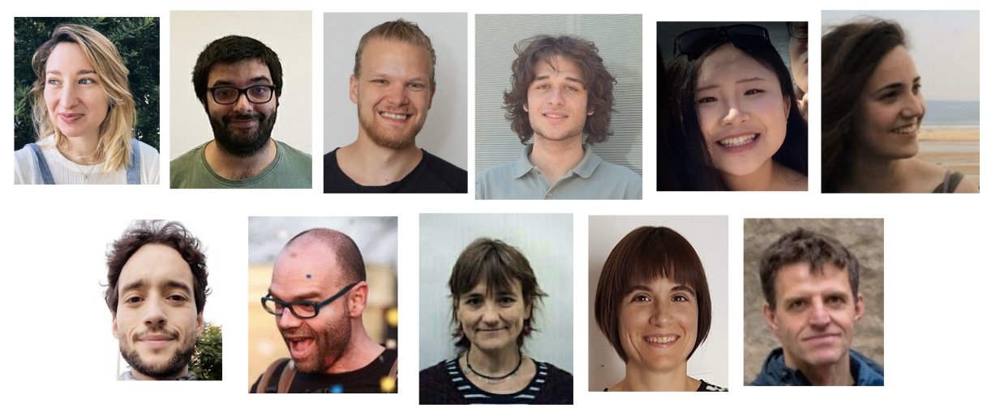
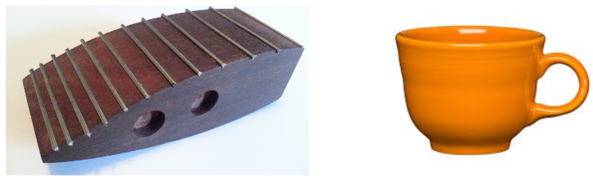
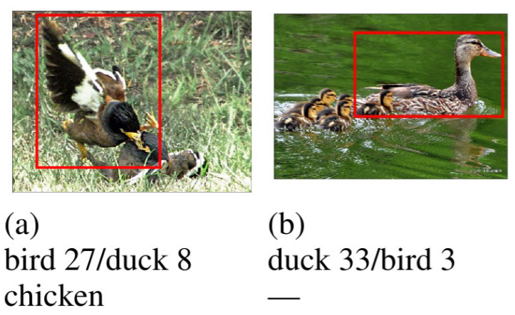

class: center
#Hello World

---
#Get to know us; get in touch!

[https://www.upf.edu/web/colt](https://www.upf.edu/web/colt)
   
* Who we are and how to reach us

* Current projects

* Events

---
#Research at COLT 

* Main goal: understand how language works

* Interdisciplinary:

  * computational linguistics
  
  * artificial intelligence
  
  * formal linguistics
  
  * cognitive science
  
---
#Selection of areas of research

Semantics and pragmatics

Grounding language in vision

Reference

Entity representations in neural network "memory"

Language evolution

Linguistic knowledge & abilities of neural nets

---
class: inverse, center
#Illustration of some active research

---
.left-column[ Mutual exclusivity]
.right-column[]
    
      

## &nbsp;&nbsp;&nbsp;&nbsp;&nbsp;&nbsp; &nbsp;&nbsp;&nbsp;&nbsp; &nbsp;&nbsp;&nbsp; &nbsp;&nbsp;&nbsp; &nbsp;&nbsp; &nbsp;&nbsp;&nbsp;&nbsp;&nbsp;&nbsp; &nbsp;&nbsp;&nbsp;&nbsp;&nbsp;&nbsp;  &nbsp;&nbsp;&nbsp;&nbsp;&nbsp;&nbsp; Give me the dax!

.footnote[
***
Gulordava, Brochhagen & Boleda. CogSci 2020. Deep daxes: Mutual exclusivity arises through both learning biases and pragmatic strategies in neural networks
]
---
.left-column[  Compositionality]
.right-column[**Training**: `jump`; &nbsp;`run`; &nbsp; `run twice`; &nbsp; ...  **Testing**: `jump twice` ]

.footnote[
***
Dessi & Baroni. (ACL 2019) CNNs found to jump around more skill-fully than RNNs.
]

---
.left-column[ Naming variation]
.right-column[]

.footnote[
***
Silberer, Zarrieß & Boleda (LREC 2020). Object Naming in Language and Vision: A Survey and a New Dataset.

Silberer, Zarrieß, Westera & Boleda (CoLing 2020). Humans Meet Models on Object Naming: A New Dataset and Analysis.]

---
class: inverse, center
#... and much more

---
#Get to know us; get in touch!

[https://www.upf.edu/web/colt](https://www.upf.edu/web/colt)
   
* Who we are and how to reach us

* Current projects

* Events