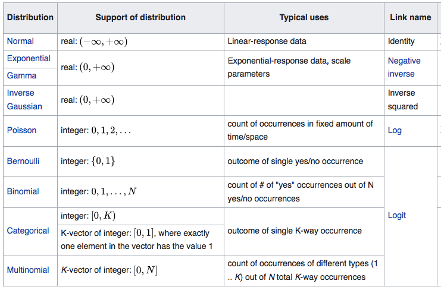

```{r preamble, echo=FALSE, message=FALSE, warning=FALSE}
library(dplyr)
library(ggplot2)
library(readr)
library(rethinking)
library(ggpubr)
library(mgcv)
library(tidyr)
```

```{r fdata, echo=FALSE, message = FALSE, Ewarning=FALSE}
low <- rpois(1000, lambda=0.5)
low.sim <- rnorm(1000,mean=0.1,0.1) #values won't be in [0,1] but that's OK for now

high <- rpois(250,lambda=3)
high.sim <- rnorm(250,mean=0.6,0.1) #values won't be in [0,1] but that's OK for now

very.high <- rpois(250,lambda=1)
very.high.sim <- rnorm(250,mean=0.75,0.1) #values won't be in [0,1] but that's OK for now

#Making up fake associativity data with a correlation of 0.8 to our colexification counts
n <- length(c(low,high,very.high))
rho <- 0.8
ass <- rnorm(n,0.5,0.2)
X <- cbind(c(low,high,very.high),ass)
X.c <- scale(X,center=TRUE,scale=FALSE)
Id   <- diag(n)                               # identity matrix
Q    <- qr.Q(qr(X.c[ , 1, drop=FALSE]))      # QR-decomposition, just matrix Q
P    <- tcrossprod(Q)          # = Q Q'       # projection onto space defined by x1
x2o  <- (Id-P) %*% X.c[ , 2]                 # x2ctr made orthogonal to x1ctr
Xc2  <- cbind(X.c[ , 1], x2o)                # bind to matrix
Y    <- Xc2 %*% diag(1/sqrt(colSums(Xc2^2)))  # scale columns to length 1
ass <- Y[ , 2] + (1 / tan(acos(rho))) * Y[ , 1]     # final new vector
#cor(c(low,high,very.high), ass)                                    # check correlation = rho  
  
fake.df <- data.frame('colex.counts'=c(low,high,very.high),
                      'cosine.sim'=c(low.sim,high.sim,very.high.sim),
                      'associativity'=ass)
```

# Today's menu

.large[
* Linear models

* Generalized linear models

* Generalized additive models
]

---
# Disclaimers
We will focus on a **conceptual overview** and **applied workflows** to ensure your inferences stick 
<br><br>
We'll mainly use "base package" fitting functions 
<br><br>
<br><br><br><br>


.footnote[
***
.pull-left[Recommended readings for less hand-waving:
* McElreath's [Statistical Rethinking](https://xcelab.net/rm/statistical-rethinking/)
* Gelman et al's [Regression and Other Stories](https://avehtari.github.io/ROS-Examples/)
* Wood's [Generalized Additive Models](https://www.routledge.com/Generalized-Additive-Models-An-Introduction-with-R-Second-Edition/Wood/p/book/9781498728331)
]
.pull-right[Engage with the community:
* talk to your colleagues
* [Andrew Gelman's blog](https://statmodeling.stat.columbia.edu/)
* [Cross-validated](https://stats.stackexchange.com/)
* [Stan forums](https://discourse.mc-stan.org/)
]
]
---
#Linear model
### A quick example of something you might have done before
```{r}
data(Howell1) #partial !Kung San census data
d <- Howell1
str(d)
```

---
### Subsetting to only data from male adults

```{r}
d_males <- d %>% filter(age > 18,
                        male == 1)
str(d_males)
```

---
```{r, fig.align='center'}
p1 <- ggplot(data= d_males, aes(x = weight, y=height)) +
      geom_point() +
      theme_minimal() + theme(text= element_text(size=20))
```
```{r, echo=FALSE, fig.align='center'}
p1
```


---

```{r, fig.align='center', message=FALSE, warning=FALSE}
p1 +
geom_smooth(method='lm', level=0.89) #level sets the CI #<<
```
---
#Numeric summary of our regression
```{r}
lmodel_dmales <- lm(data = d_males, formula(height ~ weight))
summary(lmodel_dmales)
```

---
class: center, inverse

#In a sense we're done
#but what does this all mean?

---
class: center, inverse

# Neither this


---
class: center, inverse

# Nor this


---

#Goal 
Characterize (predictive) relationship of a **response** to one or multiple **predictors** 
--

## Subgoals
* Quantify not only directionality and existence of effect but its magnitude

* Quantify certainty of estimate

* Quantify relative predictive contribution of different predictors


---
#A family of models

###Linear Models
Linear relationship of a normally distributed response to one or multiple predictors
--

###Generalized Linear Models
Linear relationship of a not-necessarily normally distributed response to one or multiple predictors
--

###Generalized Additive models
Not-necessarily linear relationship of a not-necessarily normally distributed response to one or multiple predictors

---


# General workflow: Model check
**Validity** <br>Does the data and model you are analyzing map to the research question?
<br>

**Additivity and linearity**<br>
The most important mathematical assumption of a regression model is that its deterministic component is a linear function of the separate predictors
<br>

**Independence of errors**<br><br>

**Equal variance of errors**<br><br>

**Normality of errors**


.footnote[
***
Snippets from Gelman & Hill's [Data Analysis Using Regression and Multilevel/Hierarchical Models](http://www.stat.columbia.edu/~gelman/arm/)
]

---
### Tip #1: Do multiple visual checks, first with simulated data
```{r misspecify, echo = FALSE, warning=FALSE, fig.height=7,fig.width=10, fig.align='center'}
set.seed(15)
model_list = c("right model", 
               "wrong distribution",
               "heteroskedasticity",
               "dependent data",
               "wrong functional form")
n <- 60
sigma=1
x <- seq(-1,1, length=n)
model_data <- as.data.frame(expand.grid( x=x,model=model_list))
model_data$y <- 5*model_data$x^2 + 2*model_data$x
for(i in model_list){
  if(i == "right model"){
    model_data[model_data$model==i, "y"] <- model_data[model_data$model==i, "y"]+ 
      rnorm(n,0, sigma)
  } else if(i == "wrong distribution"){
    model_data[model_data$model==i, "y"] <- model_data[model_data$model==i, "y"]+ 
      rt(n,df = 3)*sigma
  } else if(i == "heteroskedasticity"){
    model_data[model_data$model==i, "y"] <- model_data[model_data$model==i, "y"]+  
      rnorm(n,0, sigma*10^(model_data[model_data$model==i, "x"]))
  } else if(i == "dependent data"){
    model_data[model_data$model==i, "y"] <- model_data[model_data$model==i, "y"]+ 
      arima.sim(model = list(ar=c(.7)), n = n,sd=sigma) 
  } else if(i=="wrong functional form") {
    model_data[model_data$model==i, "y"] <- model_data[model_data$model==i, "y"]+ 
      rnorm(n,0, sigma) + ifelse(model_data[model_data$model==i, "x"]>0, 5,-5)
  }
}
ggplot(aes(x,y), data= model_data)+
  geom_point()+
  geom_line(color=ifelse(model_data$model=="dependent data", "black",NA))+
  facet_wrap(~model)+
  geom_smooth(method=gam, formula = y~s(x,k=12),method.args = list(method="REML")) +
  theme_minimal() +
  theme(strip.text = element_text(size=15, face='bold'))
```
.pull-right[.footnote[
.small[&nbsp;&nbsp;&nbsp;&nbsp;&nbsp;&nbsp;&nbsp;&nbsp;&nbsp;&nbsp;&nbsp;&nbsp;&nbsp;&nbsp;&nbsp;&nbsp;&nbsp;&nbsp;&nbsp;&nbsp;&nbsp;&nbsp;&nbsp;Examples from [Gavin &nbsp;&nbsp;&nbsp;&nbsp;&nbsp;&nbsp;&nbsp;&nbsp;&nbsp;&nbsp;&nbsp;&nbsp;&nbsp;&nbsp;&nbsp;&nbsp;&nbsp;&nbsp;&nbsp;&nbsp;&nbsp;&nbsp; Simpson's webinar on GAMs](https://github.com/gavinsimpson/intro-gam-webinar-2020/blob/master/gam-intro.Rmd)
]]]
---
### "Simulated data" sounds fancy but it doesn't have to be
```{r}
set.seed(5)

fake.heights <- rnorm(1000,
                      mean = mean(d_males$height),
                      sd = 10)


fake.weights <- (fake.heights * 0.3) +
                rnorm(1000,0,5)


fake.df <- data.frame('height' = fake.heights,
                      'weight' = fake.weights)

```

---

```{r}
str(fake.df)
summary(lm(data=fake.df, height ~ weight))
```
---

#General workflow: It's an iterative process
1. What assumptions go into the model(s)? 
2. Reversely, what's the right model for these assumptions?
3. Check with simulated data &#128257;
4. Check simplest model with real data &#128257;
5. Check more complex models with real data / more of the data &#128257;
6. Model comparison if you have multiple models

.footnote[***
The verb *check* means: (i) model diagnostics; (ii) model validation; (iii) model evaluation; (iv) predictive checks]


---

class: inverse, center
#Linear models
Linear relationship of a normally distributed response to one or multiple predictors

---

#Quick note on normals being normal
<br><br><br><br><br><br>

$$y \sim \text{Normal}(\mu,\sigma)$$
.footnote[ ***
Useful to remember: about $95\%$ of values around $\mu$ are within $2 \times \sigma$ <br>
More of a mouthful: ["The 68-95-99 Rule"](https://en.wikipedia.org/wiki/68%E2%80%9395%E2%80%9399.7_rule)
]
---
```{r}
n1 <- rnorm(1000,mean=5,sd=1)
n2 <- rnorm(1000,mean=5,sd=0.1)
n3 <- rnorm(1000,mean=5,sd=5)
```

```{r, echo=FALSE,message=FALSE,warning=FALSE, fig.align='center'}
df <- data.frame(x = c(n1,n2,n3), y=as.character(c(rep(1,1000),
                                      rep(0.1,1000),
                                      rep(5,1000))))
ggplot(df,aes(x=x)) + geom_histogram(aes(y =..density..),
                    bins=50,
                   colour = "black", 
                   fill = "white") +
stat_function(fun = dnorm, args = list(mean = mean(df$x), sd = sd(df$x))) + facet_wrap(~y) + theme_minimal() + theme(text= element_text(size=20))
```

---
## Back to the !Kung San data 
```{r, echo=FALSE, fig.align='center'}
p2 <- ggplot(data=d_males, aes(x = height)) + geom_histogram(aes(y = ..density..), binwidth = 1, color = "grey30", fill = "white") + geom_density(fill='red',alpha=0.3) + theme_minimal() +theme(text= element_text(size=20))
ggarrange(p2, NULL, p1,
          nrow=1, widths = c(1, 0.05, 1)
          )
```

---
# Linear model
.left-column[
General form
] $$y_i \sim \text{Normal}(\mu,\sigma)\\ \mu = \beta_0 + \beta_1 x_{1i} + ... + \beta_n x_{ni}$$
<br><br><br><br>
.left-column[
Our example 
] $$\text{height}_i \sim \text{Normal}(\mu,\sigma)\\ \mu = \beta_0 + \beta_1 \text{weight}_i$$
---

.pull-left[
```{r,echo=FALSE, message=FALSE, warning=FALSE, fig.height=4, fig.width=4}
p1 + geom_smooth(method='lm')
````
]

.pull-right[
$$\text{height}_i \sim \text{Normal}(\mu,\sigma)\\ \mu = \beta_0 + \beta_1 \text{weight}_i$$
<br><br>
Point prediction for a $53$kg adult male: $126+(53\times0.7) = 163\text{cm}$. **Is this reasonable?**
]


````{r, echo=FALSE}
summary(lmodel_dmales)
```
---

#Practical consideration:<br> Transform your data where relevant

```{r}
precis(lmodel_dmales)
d_males$weight_centered <- d_males$weight - mean(d_males$weight) #<<
lmodel2_males <- lm(data=d_males, formula=height ~ weight_centered)
precis(lmodel2_males)
```

---
# Workflow: Model check (so far)
1. Our model and data make sense for the research question we're after  `r knitr::asis_output("\U2713")`

2. Visual check(s) `r knitr::asis_output("\U2713")`

3. Sanity check of coefficients and their errors `r knitr::asis_output("\U2713")`

4. Errors

  * Independence of errors
  * Equal variance of errors
  * Normality of errors
---
# Residual error

```{r,echo=FALSE, warning=FALSE, message=FALSE, fig.align='center'}
p1 + geom_smooth(method='lm')
```

---
Well-behaved errors have no trend and (less importantly) are normally distributed with mean of 0

```{r, fig.align='center'}
plot(lmodel2_males, which=c(1))
```

---
# Workflow: Model evaluation and model comparison
1. Are there more/less predictors that could be included in a model? Or alternative models? Or alternative parametrizations? How does this affect  *performance*?
  * Watch out for: collinearity & masked relationships
  * Be mindful of: model identifiability
  * Decide in advance: criterion for model ranking
  
2. Question your model(s): Am I interested in just characterizing the data?  What is a good metric for performance in the first place? Do I want to prediction unseen data points?

.footnote[
***
N.B.: If there is interest in a session on (1)
]

---
class: inverse, center
# Questions so far?
---

class: inverse, center
#Generalized linear models
Linear relationship of a not-necessarily normally distributed response to one or multiple predictors

---
# Non-normal data: far from abnormal
A lot of (linguistic) data does not have an approximately normal form

* Experimental data: binary, Likert scales, ...

* Corpus data: counts, ...
* ...

---
# GLMs: What's new

1. Distribution: How your data's (assumed to be) distributed 

2. Link function: Distribution we impose on error terms. More practically: Its job is to map a linear space of the model to the non-linear space of a parameter. 
--
<br><br><br>

.left-column[LM as GLM]
$$y_i \sim \text{Normal}(\mu,\sigma)\\
f(\mu) = \beta_0 + \beta x_i$$

<br><br>.left-column[A Bernoulli GLM]
$$y_i \sim \text{Binomial}(1,p_i)\\
f(p_i) = \beta_0 + \beta x_i$$

---
### Link functions
* Looks complex, but just an added assumption to keep track of

* Can be put to the test
  * Informally: check what happens if you change the link function
  * Formally: Sensitivity testing, a.o.
  
* In practical terms, [each distribution comes with a canonical link function](https://en.wikipedia.org/wiki/Generalized_linear_model#Link_function)

* In more practical terms: *log*, *logit*, or *probit* are likely to meet your needs

---
###A starting point


---
# Colexification
```{r, echo=FALSE, warning=FALSE, message=FALSE}
df <- read_csv('../../Colexification/data/local/df_colex_and_cosine.csv')
```

```{r, fig.width=5}
glimpse(df) #raw-ish data enriched with fastText cosine sims
```

---
# What are we modeling?
## Option A
Model that predicts likelihood of concepts $x$ and $y$ colexifying (in language $i$?) based on cosine similarity; associativity; phyologenetic distance; geographic distance; ...

  * Response: $p(\text{colex}(x_i,y_i))$ for language $i$
  
  * Predictors: cosine similarity, ...
  * Distribution: Bernoulli 
  * Canonical link function: logit
  
---
## Option B
Model that predicts how often $x$ and $y$ colexify based on the above
  * Response: $P(\sum_i\text{colex}(x_i,y_i) = k)$
  
  * Predictors: ...
  * Distribution: Possion
  * Canonical link function: log
  
---
#Specifying Option B
$$count.colex(\langle x,y\rangle_i) \sim \text{Pois}(\lambda)\\
log(\lambda) = \beta_0 + \beta_1 cosine.sim(\langle x,y\rangle_i)$$

---
#Getting the counts 
```{r, warning=FALSE, message=FALSE}
df_counts <- df %>% select(Concepticon_Gloss.x,Concepticon_Gloss.y,
                           colex, cosine_sim) %>%
       group_by(Concepticon_Gloss.x,Concepticon_Gloss.y) %>%
       mutate(colex.sum = sum(colex)) %>%
       ungroup() %>%
       arrange(desc(colex.sum)) %>%
       select(-c(colex)) %>%
       unique() %>% drop_na
glimpse(df_counts)
```

---
##Visual impression
```{r, echo=FALSE, warning=FALSE, message=FALSE, fig.align='center', echo=FALSE}
glmplot <- ggplot(df_counts,aes(x=cosine_sim,y=colex.sum)) + geom_point() + theme_minimal() + theme(text = element_text(size=20))
```

```{r, warning=FALSE, message=FALSE, fig.align='center', echo=FALSE}
glmplot + geom_smooth(method='glm', #<<
          method.args=list(family = poisson(link = 'log')), #<<
          level=0.89)
```

---

# Numeric output
```{r}
m.colex_counts <- glm(data=df_counts,
                      formula=colex.sum ~ cosine_sim,
                      family=poisson(link = 'log')) #<<
summary(m.colex_counts)
```

---
# Some practical implications
```{r}
precis(m.colex_counts)
intercept <- precis(m.colex_counts)$mean[1]
beta_cosine <- precis(m.colex_counts)$mean[2]

exp( intercept + beta_cosine*0.1 ) #<<
exp( intercept + beta_cosine*0.5 ) #<<
exp( intercept + beta_cosine*0.9 ) #<<
```


---

# To note
GLM residuals can look funky

Checking them is conditioned on the assumed response distribution

We won't deal with this today

---

class: inverse, center
#Generalized Additive Models
Not-necessarily linear relationship of a not-necessarily normally distributed response to one or multiple predictors

---
#A colexification GAM
$$count.colex(\langle x,y\rangle_i) \sim \text{Pois}(\lambda)\\
log(\lambda) = \beta_0 + s(\beta_1 cosine.sim(\langle x,y\rangle_i))$$

---

#Visual impression
```{r, warning=FALSE, message=FALSE, fig.align='center', echo=FALSE}
glmplot +geom_smooth(method='gam', method.args=list(
                     family = poisson(link = 'log'), method='REML'), level=0.89)
```

---

# Numeric output

```{r}
gam.colex_counts <- gam(colex.sum ~ s(cosine_sim, k=10), #<<
                      data=df_counts,
                      family=poisson(link = 'log'),
                      method='REML') #<<
```
```{r, echo=FALSE, message=FALSE, warning=FALSE}
summary(gam.colex_counts)
```

---

# The predictor

```{r, fig.align='center'}
plot(gam.colex_counts)
```

---

# Outlook: New GAM decisions

* What kind of estimator to use 

* What kind of a basis function for a predictor (e.g., thin plate splines)
* Number of basis functions

---

class: inverse, center

